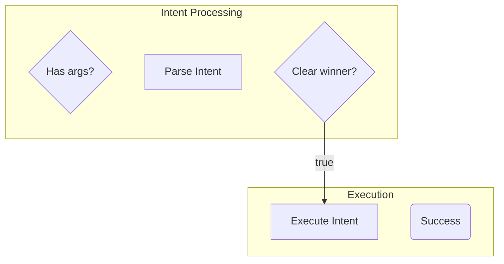
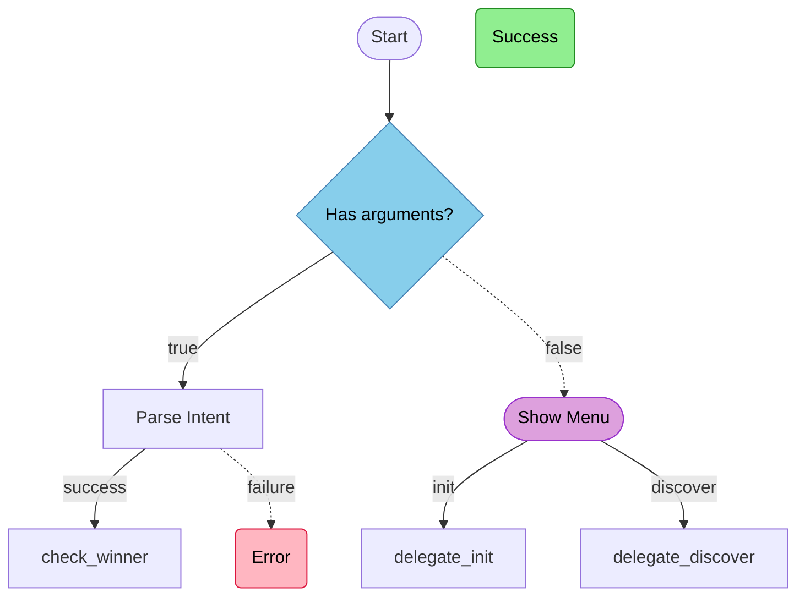

# Diagram Element Mapping

> **Used by:** `SKILL.md` Phase 3, Steps 3.1-3.3
> **Purpose:** Mapping rules from workflow elements to Mermaid diagram elements

This pattern defines the complete mapping from workflow.yaml structures to Mermaid diagram syntax,
including node shapes, edge styles, class definitions, label sanitization, and orientation selection.

---

## Node Type to Mermaid Shape

Map each workflow node type to its corresponding Mermaid shape syntax:

| Node Type | Mermaid Shape | Open Syntax | Close Syntax | Visual Purpose |
|-----------|---------------|-------------|--------------|----------------|
| `action` | Rectangle | `[` | `]` | Standard processing step |
| `conditional` | Diamond | `{` | `}` | Decision point (true/false) |
| `conditional (audit)` | Diamond | `{` | `}` | Validation gate (multi-check) |
| `user_prompt` | Stadium | `([` | `])` | User interaction point |
| `reference` | Subroutine | `[[` | `]]` | External documentation |
| `ending` (success) | Rounded | `(` | `)` | Successful terminal state |
| `ending` (error) | Rounded | `(` | `)` | Error terminal state |

### Usage Pattern

```pseudocode
function get_shape(node_type):
  MATCH node_type:
    "action"              -> { open: "[",  close: "]"   }
    "conditional"         -> { open: "{",  close: "}"   }
    "user_prompt"         -> { open: "([", close: "])"  }
    "reference"           -> { open: "[[", close: "]]"  }
    "ending" (any)        -> { open: "(",  close: ")"   }
    DEFAULT               -> { open: "[",  close: "]"   }
```

### Example Node Definitions

```mermaid
check_args{Has arguments?}:::conditional
parse_intent[Parse Intent]
show_menu([Show Menu]):::userPrompt
docs_ref[[Documentation]]:::reference
success(Success):::success
error(Error):::error
```

---

## Transition Type to Edge Style

Map workflow transition types to Mermaid edge syntax:

| Transition Field | Edge Type | Arrow Style | Syntax Pattern | Use Case |
|------------------|-----------|-------------|----------------|----------|
| `on_success` | Solid | `-->` | `A -->|success| B` | Primary success path |
| `on_failure` | Dashed | `-.->` | `A -.->|failure| B` | Error handling path |
| `branches.true` | Solid | `-->` | `A -->|true| B` | Conditional true branch |
| `branches.false` | Dashed | `-.->` | `A -.->|false| C` | Conditional false branch |
| `on_response[N]` | Solid | `-->` | `A -->|option_id| B` | User selection (Nth option) |
| `next_node` | Solid unlabeled | `-->` | `A --> B` | Linear continuation |

### Edge Construction Rules

**Action nodes:**
```pseudocode
FOR action_node:
  IF has on_success:
    emit: "{node_id} -->|success| {on_success}"
  IF has on_failure:
    emit: "{node_id} -.->|failure| {on_failure}"
```

**Conditional nodes:**
```pseudocode
FOR conditional_node:
  emit: "{node_id} -->|true| {branches.true}"
  emit: "{node_id} -.->|false| {branches.false}"
```

**User prompt nodes:**
```pseudocode
FOR user_prompt_node:
  FOR each option_id, handler IN on_response:
    emit: "{node_id} -->|{option_id}| {handler.next_node}"
```

**Reference nodes:**
```pseudocode
FOR reference_node:
  emit: "{node_id} --> {next_node}"
```

### Edge Style Rationale

- **Solid arrows (`-->`)** represent the primary/expected execution path
- **Dashed arrows (`-.->`)** represent exceptional/alternative paths
- **Labels** convey the transition condition or user choice that triggers the edge
- **Unlabeled edges** indicate unconditional sequential flow

---

## ClassDef Color Definitions

Define visual classes for consistent styling across all diagrams:

| Class Name | Fill Color | Stroke Color | Text Color | Purpose |
|------------|------------|--------------|------------|---------|
| `success` | `#90EE90` (Light Green) | `#228B22` (Forest Green) | `#000` | Success endings |
| `error` | `#FFB6C1` (Light Pink) | `#DC143C` (Crimson) | `#000` | Error endings |
| `conditional` | `#87CEEB` (Sky Blue) | `#4682B4` (Steel Blue) | `#000` | Decision nodes |
| `userPrompt` | `#DDA0DD` (Plum) | `#9932CC` (Dark Orchid) | `#000` | User prompts |
| `action` | `#F0F0F0` (Light Gray) | `#696969` (Dim Gray) | `#000` | Action nodes |
| `reference` | `#FFFACD` (Lemon Chiffon) | `#DAA520` (Goldenrod) | `#000` | Reference nodes |

### Mermaid ClassDef Syntax

Add these lines at the top of every flowchart diagram (after `flowchart TD` or `flowchart LR`):

```mermaid
classDef success fill:#90EE90,stroke:#228B22,color:#000
classDef error fill:#FFB6C1,stroke:#DC143C,color:#000
classDef conditional fill:#87CEEB,stroke:#4682B4,color:#000
classDef userPrompt fill:#DDA0DD,stroke:#9932CC,color:#000
classDef action fill:#F0F0F0,stroke:#696969,color:#000
classDef reference fill:#FFFACD,stroke:#DAA520,color:#000
```

### Class Application

Append class suffix to node definitions:

```
{node_id}{shape_open}{label}{shape_close}:::{class_name}
```

Examples:
```mermaid
check_args{Has arguments?}:::conditional
show_menu([Show Menu]):::userPrompt
parse_intent[Parse Intent]:::action
docs_ref[[Documentation]]:::reference
success_end(Success):::success
error_end(Error):::error
```

---

## Label Sanitization Rules

Transform workflow node descriptions into safe Mermaid labels:

| Rule | Pattern | Transformation | Example |
|------|---------|----------------|---------|
| **Quote escaping** | `"` | Replace with `'` or `\"` | `"foo"` → `'foo'` |
| **Angle brackets** | `<` `>` | Replace with `&lt;` `&gt;` | `<type>` → `&lt;type&gt;` |
| **Line breaks** | `\n` | Replace with `<br>` | Multi-line → Single with breaks |
| **Truncation** | Length > 40 | Truncate + `...` | `Very long description text` → `Very long description...` |
| **Special chars** | `[` `]` `{` `}` `(` `)` | Wrap in quotes | `foo[bar]` → `"foo[bar]"` |
| **Ampersands** | `&` | Replace with `&amp;` | `A & B` → `A &amp; B` |
| **Hash symbols** | `#` | Replace with `&num;` | `#define` → `&num;define` |

### Sanitization Function

```pseudocode
function sanitize_label(raw_label):
  # 1. Escape quotes
  label = replace(raw_label, '"', "'")

  # 2. Escape angle brackets
  label = replace(label, '<', '&lt;')
  label = replace(label, '>', '&gt;')

  # 3. Escape hash symbols
  label = replace(label, '#', '&num;')

  # 4. Escape ampersands (MUST be last to avoid double-encoding)
  label = replace(label, '&', '&amp;')

  # 5. Replace newlines with <br>
  label = replace(label, '\n', '<br>')

  # 6. Truncate if too long
  IF length(label) > 40:
    label = substring(label, 0, 37) + "..."

  # 7. Wrap in quotes if contains shape delimiter characters
  IF contains_any(label, ['[', ']', '{', '}', '(', ')']):
    label = '"' + label + '"'

  RETURN label
```

### Fallback for Empty Labels

If a node has no `description` field, use the node ID as the label with formatting:

```pseudocode
function infer_label(node_id):
  # Replace underscores with spaces, title case
  label = replace(node_id, '_', ' ')
  label = title_case(label)
  RETURN sanitize_label(label)
```

Example: `check_arguments` → `Check Arguments`

---

## Orientation Selection

Choose diagram orientation (TD = top-down, LR = left-right) based on workflow characteristics:

| Criterion | Threshold | Recommended Orientation | Rationale |
|-----------|-----------|-------------------------|-----------|
| **Deep workflows** | Decision nodes ≥ 4 | `TD` (Top-Down) | Vertical space for branching |
| **Shallow workflows** | Total nodes ≤ 8 | `LR` (Left-Right) | Wide, compact layout |
| **Subflow diagrams** | Any isolated segment | `LR` (Left-Right) | Focused, horizontal flow |
| **State diagrams** | N/A | `stateDiagram-v2` | Alternative view (no orientation) |

### Selection Algorithm

```pseudocode
function select_orientation(workflow_context):
  IF context.is_subflow:
    RETURN "LR"  # Subflows always use left-to-right

  IF context.total_decision_nodes >= 4:
    RETURN "TD"  # Deep branching benefits from vertical space

  IF context.total_nodes <= 8:
    RETURN "LR"  # Shallow workflows fit horizontally

  # Default for medium complexity
  RETURN "TD"
```

### Orientation Impact

**TD (Top-Down):**
- Better for: Complex branching, deep hierarchies, many decision nodes
- Flow: Start at top, branches expand vertically
- Use when: More than 3 decision nodes OR total nodes > 8

**LR (Left-Right):**
- Better for: Linear flows, subflows, shallow workflows
- Flow: Start at left, progression to right
- Use when: Focused segments, ≤ 8 nodes, or explicitly selected subflows

**stateDiagram-v2:**
- Alternative representation emphasizing state transitions
- No node shape styling (all states are rectangles)
- Labels appear after `:` on transition edges
- Best for: State machine analysis, transition-focused views

---

## Subgraph Strategies (Optional)

For workflows with clear logical groupings, use Mermaid subgraphs to cluster related nodes:

| Grouping Strategy | Trigger | Syntax | Example |
|-------------------|---------|--------|---------|
| **By subflow** | User selected multiple subflows | `subgraph name ... end` | Intent Parsing, Menu Flow |
| **By phase** | Workflow has explicit phases | `subgraph Phase N ... end` | Setup, Execute, Cleanup |
| **By domain** | Nodes share common prefix | `subgraph Domain ... end` | `validate_*`, `execute_*` |

### Subgraph Syntax



**When to use subgraphs:**
- Multiple subflows selected in Phase 2
- Workflow has >15 nodes and clear logical divisions
- User explicitly requests grouped view

**When NOT to use subgraphs:**
- Simple workflows (≤8 nodes)
- Single subflow selected
- State diagram mode (not supported)

---

## Complete Example

### Workflow YAML Input

```yaml
nodes:
  check_arguments:
    type: conditional
    description: "Has arguments?"
    transitions:
      branches:
        true: parse_intent
        false: show_menu

  parse_intent:
    type: action
    description: "Parse Intent"
    transitions:
      on_success: check_winner
      on_failure: error_end

  show_menu:
    type: user_prompt
    description: "Show Menu"
    transitions:
      on_response:
        init: delegate_init
        discover: delegate_discover

endings:
  success_end:
    type: success
    message: "Success"

  error_end:
    type: error
    message: "Error"
```

### Generated Mermaid Diagram



---

## Edge Cases

### Cycles and Loops

If the workflow contains cycles (node A → B → A):
- Mermaid supports cycles naturally
- Ensure each edge is defined only once
- Use solid arrows for forward edges, dashed for backward loops

### Orphaned Nodes

If a node is defined but never referenced by any transition:
- Include in node definitions (for completeness)
- Add a note comment: `%% Orphaned: node_id`
- Do NOT render in subflow diagrams (only full diagrams)

### Missing Targets

If a transition references a node_id that doesn't exist:
- Skip the edge (do not render)
- Log warning: "Edge {source} → {target} skipped (target not found)"
- Continue rendering remaining valid edges

### Empty Descriptions

If a node has no description field:
- Use `node_id` with formatting: `title_case(replace(node_id, '_', ' '))`
- Apply sanitization as normal
- Example: `execute_intent` → `Execute Intent`

---

## Related Documentation

- **SKILL.md:** Parent skill, Phase 3 (Generate Diagram)
- **Mermaid Generation Pattern:** `${CLAUDE_PLUGIN_ROOT}/lib/patterns/mermaid-generation.md`
- **Node Mapping Pattern:** `${CLAUDE_PLUGIN_ROOT}/lib/patterns/node-mapping.md`
- **Mermaid Live Editor:** https://mermaid.live (for previewing generated diagrams)
