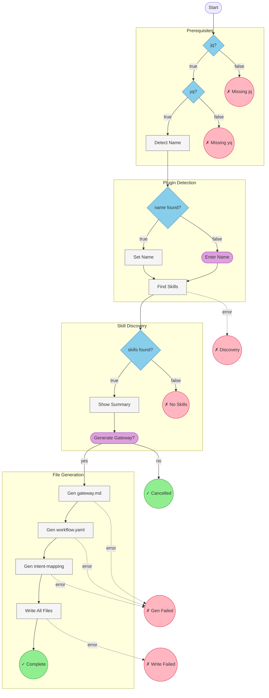

# Workflow Diagram: hiivmind-blueprint-author-gateway

## Summary

| Metric | Value |
|--------|-------|
| **Nodes** | 15 |
| **Conditionals** | 4 |
| **User Prompts** | 2 |
| **Endings** | 8 |
| **Start Node** | check_prerequisites |
