# Workflow Diagram: hiivmind-blueprint-author-setup

```mermaid
flowchart TD
    classDef success fill:#90EE90,stroke:#228B22
    classDef error fill:#FFB6C1,stroke:#DC143C
    classDef conditional fill:#87CEEB,stroke:#4682B4
    classDef userPrompt fill:#DDA0DD,stroke:#9932CC
    classDef action fill:#F5F5F5,stroke:#696969

    start([Start]) --> check_prerequisites

    subgraph Prerequisites
        check_prerequisites{jq available?}:::conditional
        check_prerequisites -->|true| check_yq{yq available?}:::conditional
        check_prerequisites -->|false| error_missing_jq
        check_yq -->|true| detect_context
        check_yq -->|false| error_missing_yq
    end

    subgraph Context Detection
        detect_context[Detect Context]:::action --> check_plugin_manifest
        check_plugin_manifest{plugin.json exists?}:::conditional
        check_plugin_manifest -->|true| record_is_plugin
        check_plugin_manifest -->|false| check_skills_directory
        record_is_plugin[Record Plugin]:::action --> check_skills_directory
        check_skills_directory{skills/ exists?}:::conditional
        check_skills_directory -->|true| record_has_skills
        check_skills_directory -->|false| check_engine_entrypoint
        record_has_skills[Record Skills]:::action --> check_engine_entrypoint
        check_engine_entrypoint{entrypoint exists?}:::conditional
        check_engine_entrypoint -->|true| record_has_entrypoint
        check_engine_entrypoint -->|false| check_version_file
        record_has_entrypoint[Record Entrypoint]:::action --> check_version_file
        check_version_file{version file exists?}:::conditional
        check_version_file -->|true| record_has_version_file
        check_version_file -->|false| evaluate_setup_needs
        record_has_version_file[Record Version]:::action --> evaluate_setup_needs
    end

    subgraph Evaluation
        evaluate_setup_needs{all setup done?}:::conditional
        evaluate_setup_needs -->|true| already_setup
        evaluate_setup_needs -->|false| confirm_setup
        already_setup([Already Setup Menu]):::userPrompt
        already_setup -->|verify| verify_setup
        already_setup -->|update| create_version_file
        already_setup -->|exit| success_no_changes
        confirm_setup([Confirm Setup]):::userPrompt
        confirm_setup -->|proceed| create_directories
        confirm_setup -->|cancel| success_cancelled
    end

    subgraph Infrastructure Creation
        create_directories[Create Dirs]:::action --> create_engine_entrypoint
        create_engine_entrypoint{needs entrypoint?}:::conditional
        create_engine_entrypoint -->|true| write_engine_entrypoint
        create_engine_entrypoint -->|false| create_version_file
        write_engine_entrypoint[Write Entrypoint]:::action --> create_version_file
        create_version_file{needs version?}:::conditional
        create_version_file -->|true| write_version_file
        create_version_file -->|false| verify_setup
        write_version_file[Write Version]:::action --> verify_setup
    end

    subgraph Verification
        verify_setup{all files valid?}:::conditional
        verify_setup -->|true| success_complete
        verify_setup -->|false| error_verification_failed
    end

    success_complete((✓ Complete)):::success
    success_no_changes((✓ No Changes)):::success
    success_cancelled((✓ Cancelled)):::success
    error_missing_jq((✗ Missing jq)):::error
    error_missing_yq((✗ Missing yq)):::error
    error_create_failed((✗ Create Failed)):::error
    error_verification_failed((✗ Verify Failed)):::error

    create_directories -.->|error| error_create_failed
    write_engine_entrypoint -.->|error| error_create_failed
    write_version_file -.->|error| error_create_failed
```

## Summary

| Metric | Value |
|--------|-------|
| **Nodes** | 22 |
| **Conditionals** | 10 |
| **User Prompts** | 2 |
| **Endings** | 7 |
| **Start Node** | check_prerequisites |
