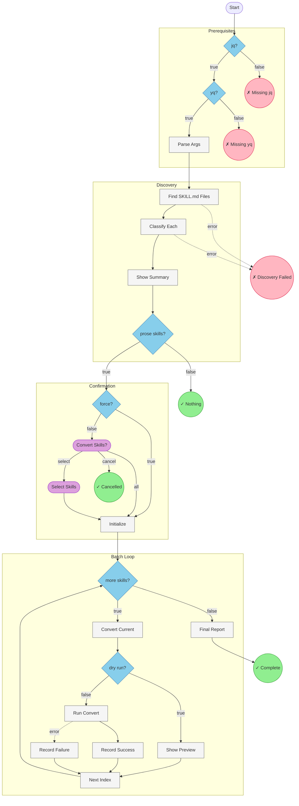

# Workflow Diagram: hiivmind-blueprint-author-upgrade

## Summary

| Metric | Value |
|--------|-------|
| **Nodes** | 19 |
| **Conditionals** | 6 |
| **User Prompts** | 2 |
| **Endings** | 6 |
| **Start Node** | check_prerequisites |
