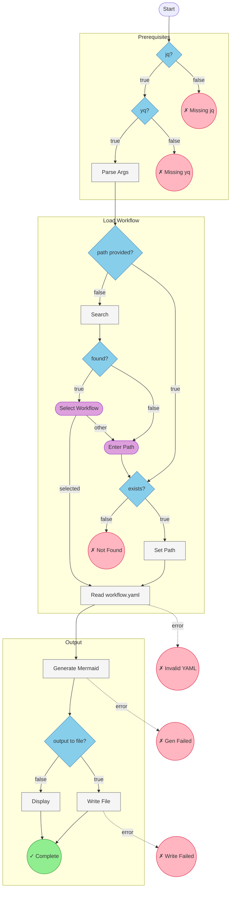

# Workflow Diagram: hiivmind-blueprint-author-visualize

## Summary

| Metric | Value |
|--------|-------|
| **Nodes** | 17 |
| **Conditionals** | 5 |
| **User Prompts** | 2 |
| **Endings** | 7 |
| **Start Node** | check_prerequisites |
