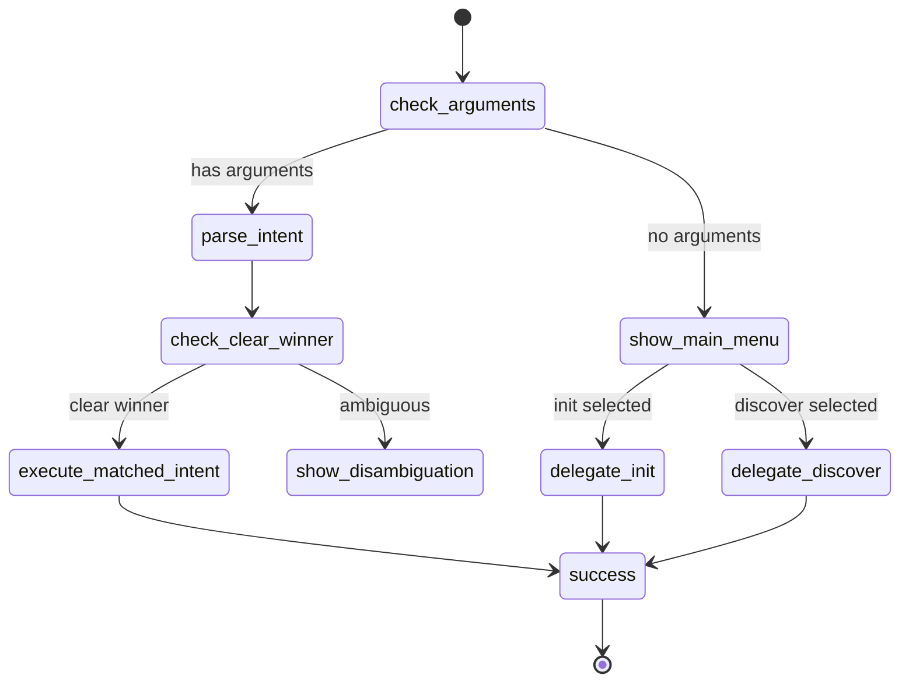

# Mermaid Diagram Generation Pattern

Pattern documentation for generating Mermaid diagrams from workflow.yaml files.

---

## Overview

This pattern describes how to transform workflow.yaml node graphs into Mermaid diagram syntax. It supports:
- Flowchart diagrams (TD/LR orientation)
- State diagrams
- Subflow extraction

---

## Node Type to Mermaid Shape Mapping

| Node Type | Purpose | Mermaid Shape | Syntax Example |
|-----------|---------|---------------|----------------|
| `action` | Execute operations | Rectangle | `node_id[Action Label]` |
| `conditional` | Branch on condition | Diamond | `node_id{Condition?}` |
| `conditional` (audit) | Validate all conditions | Diamond | `node_id{Validations?}` |
| `user_prompt` | Get user input | Stadium | `node_id([User Prompt])` |
| `ending` | Terminal state | Rounded | `node_id(Ending Message)` |

### Shape Syntax Reference

```
Rectangle:    [Label]
Diamond:      {Label}
Stadium:      ([Label])
Hexagon:      {{Label}}
Subroutine:   [[Label]]
Rounded:      (Label)
Circle:       ((Label))
```

---

## Edge Generation

### Action Nodes

Action nodes have `on_success` and optional `on_failure` transitions:

```yaml
# workflow.yaml
delegate_init:
  type: action
  on_success: success
  on_failure: error_delegation
```

```mermaid
# Generated edges
delegate_init --> success
delegate_init -.-> error_delegation
```

- **on_success**: Solid arrow (`-->`)
- **on_failure**: Dashed arrow (`-.->`)

### Conditional Nodes

Conditional nodes branch on `true`/`false`:

```yaml
# workflow.yaml
check_arguments:
  type: conditional
  branches:
    true: parse_intent
    false: show_main_menu
```

```mermaid
# Generated edges
check_arguments -->|true| parse_intent
check_arguments -.->|false| show_main_menu
```

- **true branch**: Solid arrow with label
- **false branch**: Dashed arrow with label

### User Prompt Nodes

User prompt nodes have multiple response handlers:

```yaml
# workflow.yaml
show_main_menu:
  type: user_prompt
  on_response:
    init:
      next_node: delegate_init
    discover:
      next_node: delegate_discover
```

```mermaid
# Generated edges
show_main_menu -->|init| delegate_init
show_main_menu -->|discover| delegate_discover
```

All response paths use solid arrows with the option ID as label.

### Dynamic Routes

When a node uses dynamic routing (`${computed.dynamic_target}`):

```yaml
execute_matched_intent:
  type: action
  on_success: "${computed.dynamic_target}"
```

Generate edges to all possible targets, or use a special notation:

```mermaid
execute_matched_intent -->|dynamic| delegate_init
execute_matched_intent -->|dynamic| delegate_discover
# ... or
execute_matched_intent -->|"*"| possible_targets[("Possible Targets")]
```

---

## Styling

### Class Definitions

```mermaid
classDef success fill:#90EE90,stroke:#228B22,color:#000
classDef error fill:#FFB6C1,stroke:#DC143C,color:#000
classDef conditional fill:#87CEEB,stroke:#4682B4,color:#000
classDef userPrompt fill:#DDA0DD,stroke:#9932CC,color:#000
classDef action fill:#F0F0F0,stroke:#696969,color:#000
```

### Applying Classes

Use `:::className` suffix:

```mermaid
success_end(Success):::success
error_end(Error):::error
check_arguments{has arguments?}:::conditional
show_menu([Show Menu]):::userPrompt
```

---

## Subflow Detection Algorithm

### Step 1: Build Node Graph

```python
graph = {}
for node_id, node in workflow.nodes.items():
    graph[node_id] = {
        'type': node.type,
        'successors': get_successors(node),
        'is_decision': node.type in ['conditional', 'user_prompt']
    }
```

### Step 2: Identify Decision Points

```python
decision_nodes = [n for n in graph if graph[n]['is_decision']]
```

### Step 3: Trace Segments

For each decision node, trace forward until hitting another decision or ending:

```python
def trace_segment(start_node):
    segment = [start_node]
    current = start_node

    while True:
        successors = graph[current]['successors']
        if not successors:
            break  # Reached ending

        # Take first non-decision successor
        next_node = successors[0]
        if graph[next_node]['is_decision']:
            break  # Hit another decision point

        segment.append(next_node)
        current = next_node

    return segment
```

### Step 4: Name Segments

Use node descriptions or infer from purpose:

```python
def name_segment(segment, graph):
    entry = segment[0]
    if 'intent' in entry.lower():
        return "Intent Processing"
    elif 'menu' in entry.lower():
        return "Menu Flow"
    elif 'error' in entry.lower():
        return "Error Handling"
    else:
        return graph[entry]['description'] or entry
```

---

## Full Generation Algorithm

```python
def generate_mermaid(workflow, mode='flowchart', selected_nodes=None):
    lines = []

    # Header
    if mode == 'flowchart':
        lines.append("flowchart TD")
    elif mode == 'state':
        lines.append("stateDiagram-v2")

    # Style definitions
    lines.extend([
        "    classDef success fill:#90EE90,stroke:#228B22",
        "    classDef error fill:#FFB6C1,stroke:#DC143C",
        "    classDef conditional fill:#87CEEB,stroke:#4682B4",
        "    classDef userPrompt fill:#DDA0DD,stroke:#9932CC",
        ""
    ])

    # Filter nodes if subflow selected
    nodes_to_render = selected_nodes or workflow.nodes.keys()

    # Start node
    if workflow.start_node in nodes_to_render:
        lines.append(f"    start([Start]) --> {workflow.start_node}")

    # Generate nodes and edges
    for node_id in nodes_to_render:
        node = workflow.nodes[node_id]

        # Node definition with shape
        shape = get_shape(node.type)
        label = sanitize_label(node.description or node_id)
        class_suffix = get_class(node.type)
        lines.append(f"    {node_id}{shape[0]}{label}{shape[1]}{class_suffix}")

        # Edges
        for edge in get_edges(node):
            target = edge.target
            if target in nodes_to_render or target in workflow.endings:
                style = edge.style  # '-->' or '-.->'
                label_part = f"|{edge.label}| " if edge.label else ""
                lines.append(f"    {node_id} {style}{label_part}{target}")

    # Endings
    for ending_id, ending in workflow.endings.items():
        if ending_id in get_all_targets(nodes_to_render, workflow):
            class_name = "success" if ending.type == "success" else "error"
            lines.append(f"    {ending_id}({ending.message}):::{class_name}")

    return "\n".join(lines)
```

---

## Label Sanitization

Mermaid has restrictions on label characters:

```python
def sanitize_label(label):
    # Replace problematic characters
    label = label.replace('"', "'")
    label = label.replace('<', "&lt;")
    label = label.replace('>', "&gt;")

    # Truncate long labels
    if len(label) > 40:
        label = label[:37] + "..."

    # Wrap in quotes if contains special chars
    if any(c in label for c in '[]{}()'):
        label = f'"{label}"'

    return label
```

---

## State Diagram Alternative

For state machine view, use `stateDiagram-v2`:



Key differences from flowchart:
- Uses `[*]` for start/end
- No shapes, just state names
- Transitions labeled after colon

---

## Orientation Options

| Orientation | Code | Best For |
|-------------|------|----------|
| Top-Down | `flowchart TD` | Deep workflows, many levels |
| Left-Right | `flowchart LR` | Wide workflows, few levels |
| Bottom-Up | `flowchart BT` | Unusual, rarely used |
| Right-Left | `flowchart RL` | Unusual, rarely used |

Recommendation:
- Use **TD** for workflows with 5+ levels of depth
- Use **LR** for shallow workflows (3 or fewer levels)

---

## Validation

Before output, validate the Mermaid syntax:

1. **No duplicate node definitions**
2. **All edge targets exist** (nodes or endings)
3. **Labels properly escaped**
4. **No circular class definitions**

Test by pasting into https://mermaid.live for live preview.
