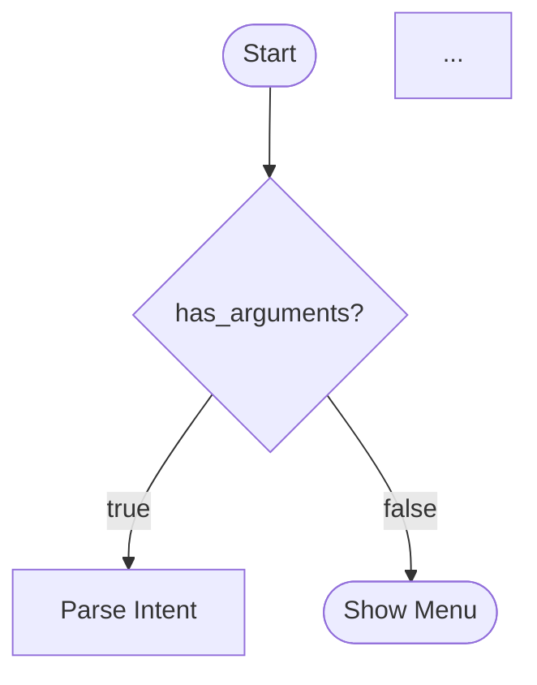
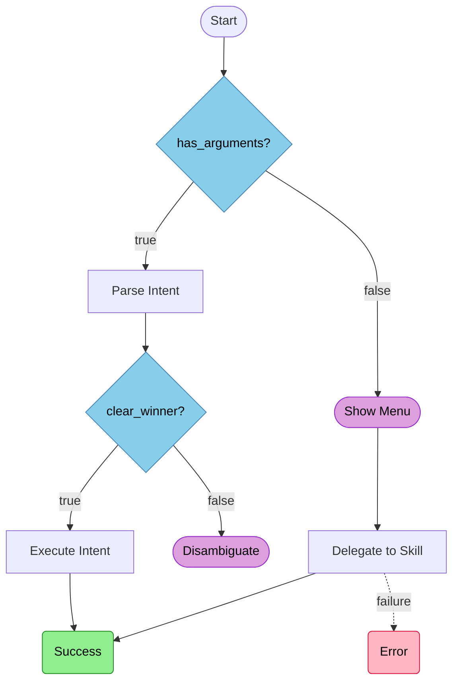
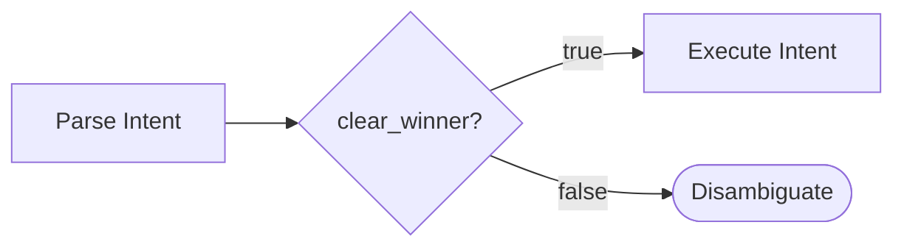
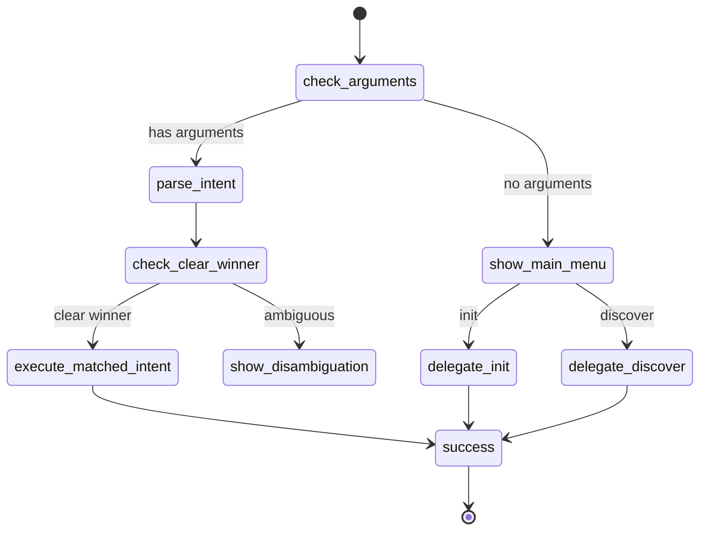

# Visualize Workflow

Generate Mermaid diagrams from workflow.yaml files, supporting end-to-end flowcharts,
subflow diagrams, and state diagrams.

> **Diagram Element Mapping:** `patterns/diagram-element-mapping.md`
> **Mermaid Generation Pattern:** `${CLAUDE_PLUGIN_ROOT}/lib/patterns/mermaid-generation.md`

---

## Overview

This skill generates Mermaid diagrams from workflow.yaml files:
- **End-to-end flowcharts** -- Complete workflow visualization
- **Subflow diagrams** -- Selected portions of the workflow
- **State diagrams** -- Alternative representation for state machines

---

## Prerequisites

**Check these dependencies before execution:**

| Tool | Required | Check | Purpose |
|------|----------|-------|---------|
| `jq` | **Mandatory** | `command -v jq` | JSON processing |
| `yq` | **Mandatory** | `command -v yq` | YAML processing |
| `gh` | Recommended | `command -v gh` | GitHub API access (private repos) |

If mandatory tools are missing, exit with error and installation guidance.

---

## Visualization Mappings

### Node Types to Mermaid Shapes

| Node Type | Mermaid Shape | Syntax |
|-----------|---------------|--------|
| action | Rectangle | `node[Action Name]` |
| conditional | Diamond | `node{Condition?}` |
| conditional (audit) | Diamond | `node{Validations?}` |
| user_prompt | Stadium | `node([User Prompt])` |
| reference | Subroutine | `node[[Reference Doc]]` |
| ending (success) | Rounded | `node(Success)` |
| ending (error) | Rounded | `node(Error)` |

### Transitions to Edge Styles

| Transition | Style | Example |
|------------|-------|---------|
| on_success | Solid green | `A -->|success| B` |
| on_failure | Dashed red | `A -.->|failure| B` |
| branches.true | Solid | `A -->|true| B` |
| branches.false | Dashed | `A -.->|false| C` |
| on_response | Labeled | `A -->|option_id| B` |

---

## Phase 1: Load Workflow

### Step 1.1: Determine Target Workflow

If user provided a path:
1. Validate the path exists
2. Read the workflow.yaml file
3. Store in `computed.workflow_content`

If no path provided:
1. Check if current directory has a workflow.yaml:
   - Glob for `**/workflow.yaml` in current directory
   - If found, ask user which one to visualize
2. If none found, **ask user** for the path:
   ```json
   {
     "questions": [{
       "question": "Which workflow would you like to visualize?",
       "header": "Target",
       "multiSelect": false,
       "options": [
         {"label": "Provide path", "description": "I'll give you the workflow.yaml path"},
         {"label": "Search current directory", "description": "Look for workflow.yaml files here"},
         {"label": "Use current skill", "description": "Visualize the skill I'm currently in"}
       ]
     }]
   }
   ```

### Step 1.2: Parse Workflow Structure

Extract from workflow.yaml:
- `name` -- Workflow identifier
- `start_node` -- Entry point
- `nodes` -- All workflow nodes with types and transitions
- `endings` -- Terminal states

Store in:
```yaml
computed:
  workflow_name: "extracted name"
  start_node: "check_arguments"
  nodes:
    - id: "node_id"
      type: "action|conditional|user_prompt|..."
      description: "Node description"
      transitions: {...}
  endings:
    - id: "success"
      type: "success|error"
```

---

## Phase 2: Analyze & Choose Mode

### Step 2.1: Detect Decision Nodes

Identify nodes that create branching:
- **conditional** nodes -- `branches.true` and `branches.false`
- **conditional (audit)** nodes -- Same as conditional but validates all conditions
- **user_prompt** nodes -- Multiple `on_response` handlers

Count and classify:
```yaml
computed:
  decision_nodes:
    - id: "check_arguments"
      type: "conditional"
      branch_count: 2
    - id: "show_main_menu"
      type: "user_prompt"
      branch_count: 4
```

### Step 2.2: Identify Subflow Boundaries

Trace workflow paths to detect natural segments:

1. **Trace from start**: Follow paths from start_node to endings
2. **Identify clusters**: Group nodes that form logical units
3. **Name subflows**: Use node descriptions or infer from purpose

Algorithm:
```pseudocode
For each decision node:
  1. Trace forward to next decision or ending
  2. Collect all nodes in this segment
  3. Name based on entry node description
  4. Count nodes in segment
```

Example detected subflows:
```yaml
computed:
  subflows:
    - name: "Intent Parsing Flow"
      entry: "check_arguments"
      nodes: ["check_arguments", "parse_intent", "check_clear_winner"]
      exit_to: ["execute_matched_intent", "show_disambiguation"]
    - name: "Menu Flow"
      entry: "show_main_menu"
      nodes: ["show_main_menu", "delegate_init", "delegate_discover"]
      exit_to: ["success", "error_delegation"]
```

### Step 2.3: Present Visualization Options

Ask user which visualization mode:

```json
{
  "questions": [{
    "question": "How would you like to visualize the workflow?",
    "header": "Mode",
    "multiSelect": false,
    "options": [
      {"label": "Full diagram (Recommended)", "description": "Complete end-to-end workflow visualization"},
      {"label": "Subflows", "description": "Choose specific portions to visualize"},
      {"label": "State diagram", "description": "Alternative stateDiagram representation"}
    ]
  }]
}
```

If **Subflows** selected, present detected subflows:

```json
{
  "questions": [{
    "question": "Which subflows would you like to visualize?",
    "header": "Subflows",
    "multiSelect": true,
    "options": [
      {"label": "Intent Parsing", "description": "check_arguments -> check_clear_winner (3 nodes)"},
      {"label": "Menu Flow", "description": "show_main_menu -> delegations (8 nodes)"},
      {"label": "Disambiguation", "description": "show_disambiguation -> delegations (5 nodes)"},
      {"label": "Error Handling", "description": "All error paths (2 nodes)"}
    ]
  }]
}
```

Store `computed.diagram_mode` ("flowchart" or "state"), `computed.selected_nodes`,
and `computed.orientation` ("TD" or "LR") based on selection. Use TD for deep
workflows (4+ decision nodes), LR for shallow workflows or subflow views.

---

## Phase 3: Generate Diagram

### Step 3.1: Build Node Definitions

For each node in the selected scope, generate Mermaid syntax:

```pseudocode
For each node:
  shape = get_shape(node.type)
  label = sanitize(node.description or node.id)
  output: "{node.id}{shape_open}{label}{shape_close}"
```

Shape mapping:
```
action         -> [Label]
conditional    -> {Label?}
user_prompt    -> ([Label])
reference      -> [[Label]]
ending.success -> (Success)
ending.error   -> (Error)
```

### Step 3.2: Build Edges

For each node, generate transition edges:

**Action nodes:**
```mermaid
{node_id} -->|success| {on_success}
{node_id} -.->|failure| {on_failure}
```

**Conditional nodes:**
```mermaid
{node_id} -->|true| {branches.true}
{node_id} -.->|false| {branches.false}
```

**User prompt nodes:**
```mermaid
{node_id} -->|{option_id}| {on_response.{option_id}.next_node}
```

**Reference nodes:**
```mermaid
{node_id} --> {next_node}
```

Only emit edges whose targets are within `computed.selected_nodes` or ending IDs.

### Step 3.3: Apply Styling

Add class definitions for visual distinction:

```mermaid
classDef success fill:#90EE90,stroke:#228B22,color:#000
classDef error fill:#FFB6C1,stroke:#DC143C,color:#000
classDef conditional fill:#87CEEB,stroke:#4682B4,color:#000
classDef userPrompt fill:#DDA0DD,stroke:#9932CC,color:#000
classDef reference fill:#FFFACD,stroke:#DAA520,color:#000
```

Apply classes to nodes:
- Endings with `type: success` -- `:::success`
- Endings with `type: error` -- `:::error`
- Conditional nodes -- `:::conditional`
- User prompt nodes -- `:::userPrompt`
- Reference nodes -- `:::reference`

### Step 3.4: Assemble Complete Diagram

Combine into final output:

For **flowchart** mode: header (`flowchart TD|LR`), classDefs, start connector
(`start([Start]) --> {start_node}`), node definitions, edges.

For **state** mode: header (`stateDiagram-v2`), start transition (`[*] --> {start_node}`),
state transitions with colon-labeled edges, terminal transitions (`{success} --> [*]`).

Store assembled output in `computed.diagram_output`.

---

## Phase 4: Output

### Step 4.1: Display Diagram

Output the Mermaid diagram in a code block:

~~~markdown

~~~

### Step 4.2: Offer File Output

Ask if user wants to save:

```json
{
  "questions": [{
    "question": "Would you like to save this diagram to a file?",
    "header": "Save",
    "multiSelect": false,
    "options": [
      {"label": "Display only", "description": "Just show it here"},
      {"label": "Save to docs/", "description": "Write to docs/workflow-diagram.md"},
      {"label": "Save to README", "description": "Append to README.md"}
    ]
  }]
}
```

If saving:
1. Wrap diagram in appropriate markdown
2. Write to specified location
3. Confirm save path

---

## Output Examples

### End-to-End Flowchart



### Subflow (Selected Nodes Only)



### State Diagram (Alternative)



---

## Reference Documentation

- **Diagram Element Mapping:** `patterns/diagram-element-mapping.md`
- **Mermaid Generation Pattern:** `${CLAUDE_PLUGIN_ROOT}/lib/patterns/mermaid-generation.md`
- **Node Mapping Pattern:** `${CLAUDE_PLUGIN_ROOT}/lib/patterns/node-mapping.md`

---

## Related Skills

- Workflow analysis: `${CLAUDE_PLUGIN_ROOT}/skills-prose/bp-skill-analyze/SKILL.md`
- Prose-based migration: `${CLAUDE_PLUGIN_ROOT}/skills-prose/bp-prose-migrate/SKILL.md`
- Plugin discovery: `${CLAUDE_PLUGIN_ROOT}/skills-prose/bp-plugin-discover/SKILL.md`
